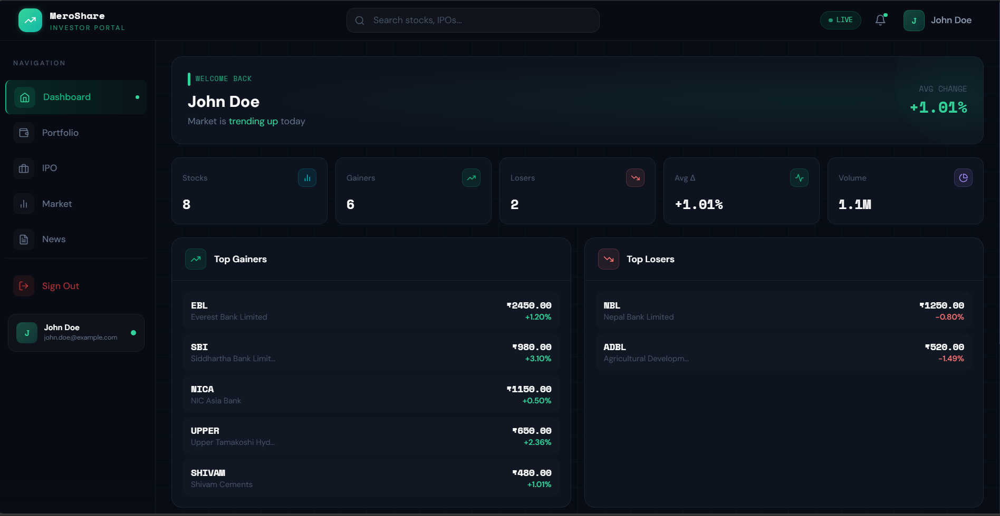
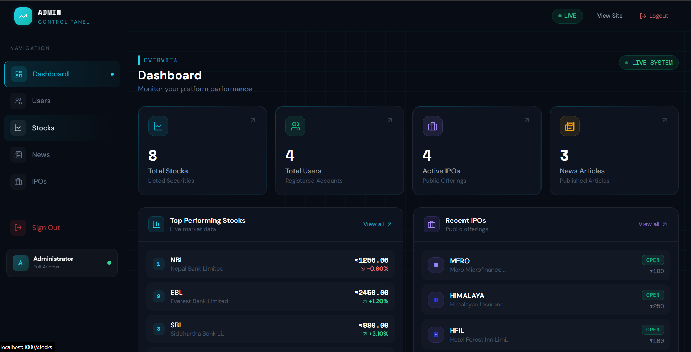
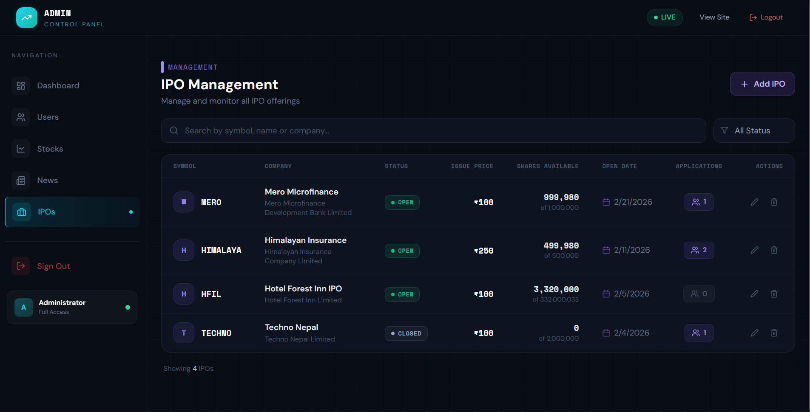
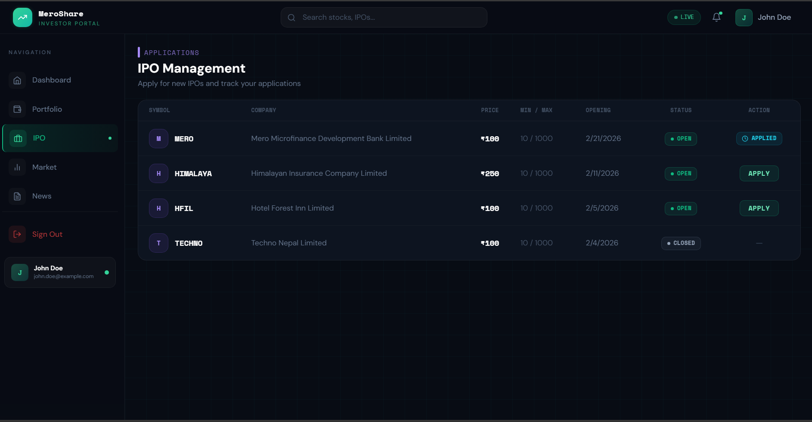
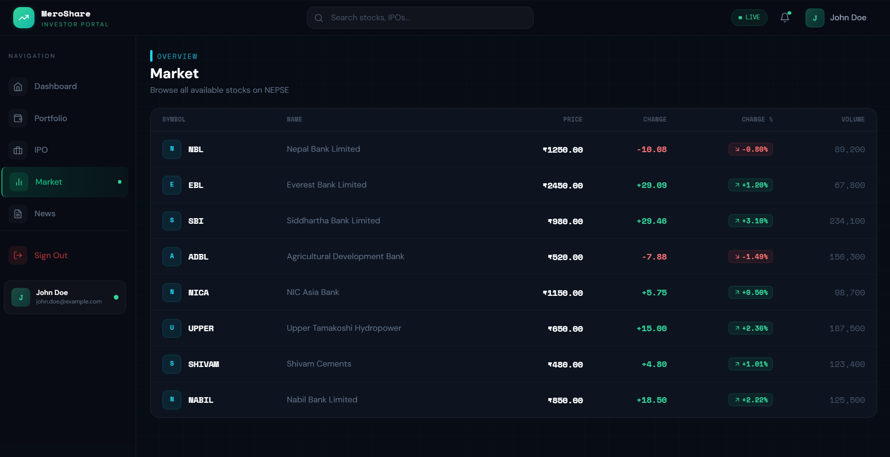
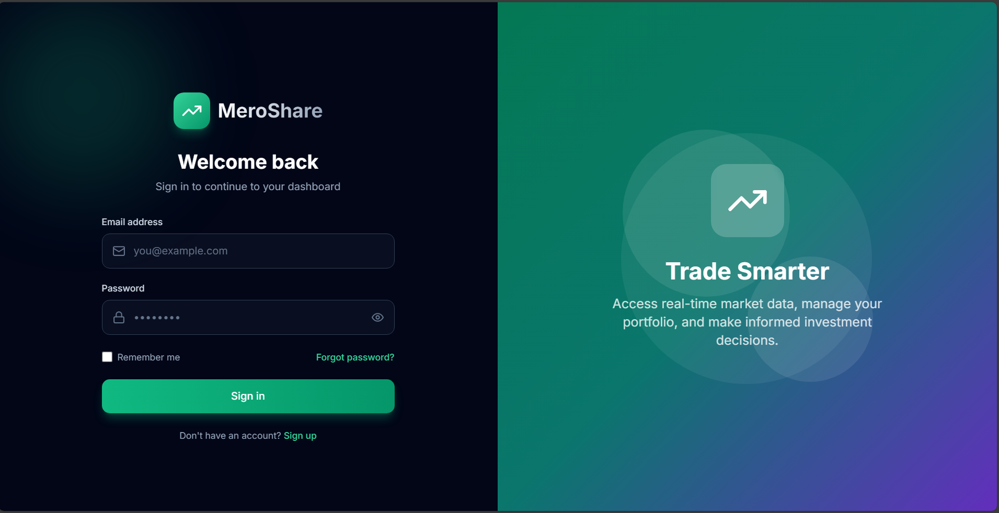
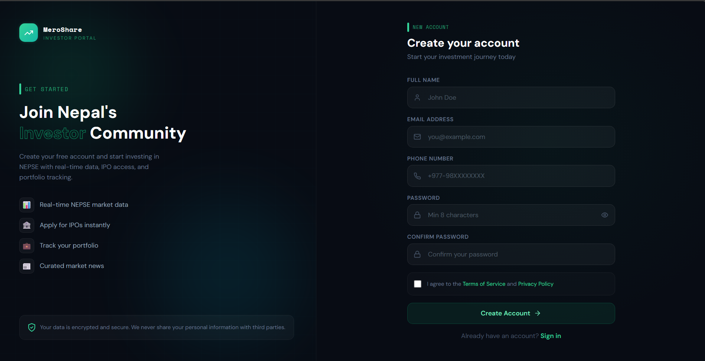

# 📈 Nepali Stock Market Application


> [!IMPORTANT]
> **Project Status: 🚧 Still in progress**
> This application is currently under active development. Some features may be incomplete or undergoing changes.

> A comprehensive full-stack web application for tracking Nepali stock market data, IPOs, news, and portfolio management with real-time updates.

---

## 📸 Screenshots

<div align="center">

### Home / Dashboard


### Market Data


### IPO Management


### News Feed


### Portfolio Tracking


### User Settings


### Admin Overview


</div>

---

## 🚀 Features

| Feature | Description |
|---------|-------------|
| 📊 **Real-time Stock Data** | Live NEPSE stock prices and market data with instant updates |
| 🏢 **IPO Management** | Track and apply for Initial Public Offerings seamlessly |
| 💼 **Portfolio Management** | Manage your stock portfolio and track performance |
| 👁️ **Watchlist** | Create and manage custom watchlists for your favorite stocks |
| 📰 **News & Updates** | Latest market news and analysis from reliable sources |
| 🔐 **User Authentication** | Secure login and registration with JWT tokens |
| 👨‍💼 **Admin Panel** | Full admin dashboard for managing users, stocks, IPOs, and news |
| 🎨 **Professional UI** | Modern, responsive design inspired by Nepali share markets |

---

## 🛠 Tech Stack

### Backend


- Node.js with Express.js
- MongoDB with Mongoose ODM
- JWT for authentication
- Socket.IO for real-time updates
- bcryptjs for password hashing
- Express Validator for input validation

### Frontend


- Next.js 14 with TypeScript
- Tailwind CSS for styling
- Lucide React for icons
- TanStack React Query for data fetching
- Recharts for data visualization

---

## 📋 Prerequisites

- **Node.js** 18.0.0 or higher
- **MongoDB** 4.4 or higher
- **npm** 9.0.0 or higher

---

## 🚀 Quick Start

### 1. Clone the Repository

```bash
git clone https://github.com/yogeshthapa-7/nepali-stock-market.git
cd nepali-stock-market
```

### 2. Backend Setup

```bash
# Navigate to backend
cd backend

# Install dependencies
npm install

# Copy environment file
cp .env.production .env
# Configure your environment variables

# Seed database with sample data (optional)
npm run seed

# Start development server
npm run dev
```

### 3. Frontend Setup

```bash
# Navigate to frontend
cd frontend

# Install dependencies
npm install

# Copy environment file
cp .env.local .env.local
# Configure your environment variables (already configured)

# Start development server
npm run dev
```

### 4. Access the Application

| Service | URL |
|---------|-----|
| 🌐 Frontend | http://localhost:3000 |
| 🔌 Backend API | http://localhost:5000 |

---

## 📁 Project Structure

```
nepali-stock-market/
├── backend/
│   ├── config/          # Configuration files
│   ├── middleware/      # Express middleware (auth, error handling)
│   ├── models/          # MongoDB models (User, Stock, IPO, Portfolio, etc.)
│   ├── routes/          # API routes
│   ├── scripts/         # Database scripts
│   ├── services/        # Business logic (Socket.IO)
│   └── server.js        # Main server file
├── frontend/
│   ├── app/             # Next.js app directory
│   │   ├── (admin)/     # Admin panel routes (dashboard, users, stocks, ipos, news)
│   │   ├── (auth)/      # Authentication routes (login, signup)
│   │   ├── components/  # React components (Navigation)
│   │   ├── context/    # React context (AuthContext)
│   │   └── lib/         # API utilities
│   └── public/          # Static assets
├── .gitignore
├── README.md
└── ADMIN_PANEL_SETUP.md
```

---

## 🔧 Environment Variables

### Backend (.env)

```env
NODE_ENV=development
PORT=5000
MONGODB_URI=mongodb://localhost:27017/nepali-stock-market
JWT_SECRET=your-super-secret-jwt-secret-key-change-in-production
JWT_EXPIRE=7d
CLIENT_URL=http://localhost:3000
```

### Frontend (.env.local)

```env
NEXT_PUBLIC_API_URL=http://localhost:5000/api
NEXT_PUBLIC_SOCKET_URL=http://localhost:5000
```

---

## 📊 API Endpoints

### Authentication

| Method | Endpoint | Description |
|--------|----------|-------------|
| `POST` | `/api/auth/signup` | Register new user |
| `POST` | `/api/auth/login` | User login |
| `GET` | `/api/auth/me` | Get current user profile |

### Users (Admin)

| Method | Endpoint | Description |
|--------|----------|-------------|
| `GET` | `/api/users` | Get all users (admin) |
| `GET` | `/api/users/:id` | Get user by ID (admin) |
| `POST` | `/api/users` | Create user (admin) |
| `PUT` | `/api/users/:id` | Update user (admin) |
| `DELETE` | `/api/users/:id` | Delete user (admin) |

### Stocks

| Method | Endpoint | Description |
|--------|----------|-------------|
| `GET` | `/api/stocks` | Get all stocks |
| `GET` | `/api/stocks/:symbol` | Get stock by symbol |
| `POST` | `/api/stocks` | Create new stock (admin) |
| `PUT` | `/api/stocks/:symbol` | Update stock (admin) |
| `DELETE` | `/api/stocks/:symbol` | Delete stock (admin) |

### IPOs

| Method | Endpoint | Description |
|--------|----------|-------------|
| `GET` | `/api/ipos` | Get all IPOs |
| `GET` | `/api/ipos/:symbol` | Get IPO by symbol |
| `POST` | `/api/ipos` | Create IPO (admin) |
| `PUT` | `/api/ipos/:symbol` | Update IPO (admin) |
| `DELETE` | `/api/ipos/:symbol` | Delete IPO (admin) |

### News

| Method | Endpoint | Description |
|--------|----------|-------------|
| `GET` | `/api/news` | Get all news |
| `POST` | `/api/news` | Create news (admin) |
| `PUT` | `/api/news/:id` | Update news (admin) |
| `DELETE` | `/api/news/:id` | Delete news (admin) |

### Portfolio & Watchlist

| Method | Endpoint | Description |
|--------|----------|-------------|
| `GET` | `/api/portfolio` | Get user portfolio |
| `GET` | `/api/watchlist` | Get user watchlist |
| `POST` | `/api/watchlist` | Add stock to watchlist |
| `DELETE` | `/api/watchlist/:id` | Remove from watchlist |

---

## 👥 User Roles

| Role | Description | Access Level |
|------|-------------|--------------|
| `user` | Regular user | Public pages, own portfolio, own watchlist |
| `admin` | Administrator | Full access including admin panel |

### Login Redirect Behavior
- **Admin users**: Redirected to `/dashboard` (admin dashboard)
- **Regular users**: Redirected to `/` (home page)

---

## 🎨 Design Features

- **Professional Nepali Share Market Theme**: Inspired by real Nepali stock market interfaces
- **Responsive Design**: Works seamlessly on desktop, tablet, and mobile
- **Real-time Updates**: Live stock prices and market data via Socket.IO
- **Interactive Charts**: Visual representations of market data using Recharts
- **Modern UI Components**: Clean, intuitive interface with Tailwind CSS
- **Admin Dashboard**: Comprehensive admin panel for content management

---

## 🚀 Deployment

### Backend Deployment

```bash
cd backend
npm install
npm start
```

### Frontend Deployment

```bash
cd frontend
npm install
npm run build
npm start
```

---

## 📝 Scripts

### Backend

| Script | Description |
|--------|-------------|
| `npm run dev` | Start development server with nodemon |
| `npm start` | Start production server |
| `npm run seed` | Seed database with sample data |

### Frontend

| Script | Description |
|--------|-------------|
| `npm run dev` | Start development server |
| `npm run build` | Build for production |
| `npm run start` | Start production server |

---

## 🔒 Security Features

- ✅ JWT-based authentication
- ✅ Password hashing with bcrypt
- ✅ Input validation and sanitization
- ✅ Rate limiting
- ✅ CORS protection
- ✅ MongoDB injection prevention
- ✅ Role-based access control (RBAC)

---

## 🤝 Contributing

1. Fork the repository
2. Create a feature branch (`git checkout -b feature/amazing-feature`)
3. Commit your changes (`git commit -m 'feat: Add amazing feature'`)
4. Push to the branch (`git push origin feature/amazing-feature`)
5. Open a Pull Request

---

## 🆘 Support

For support and questions, please open an issue on GitHub.

---

## 🔄 Project Status

> 🚧 **This project is still in progress**

### Completed Features:
- ✅ User authentication (JWT) with role-based access
- ✅ Admin panel with dashboard, user management, stock management, IPO management, and news management
- ✅ RESTful API endpoints
- ✅ MongoDB models and relationships
- ✅ Real-time updates (Socket.IO)
- ✅ Responsive frontend with Next.js and Tailwind CSS
- ✅ Login with role-based redirects (admin → /dashboard, user → /)

---

<div align="center">

**Built with ❤️ for the Nepali Stock Market Community**


</div>
